# Hospital Backend — Entity Relationship Diagram

Derived from GORM models migrated in `shared/migration/functions.go`. Table names follow GORM’s default pluralization (no custom `TableName()` overrides). Most foreign keys are logical UUID columns; only a few associations are declared with GORM tags.

> Soft delete: `roles` and `departments` use `gorm.DeletedAt`. `roles` also has `is_deleted`.

---

## Overview

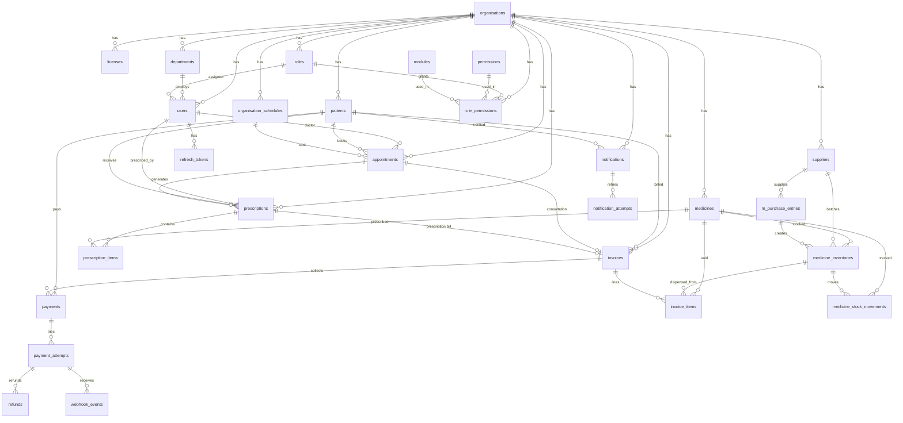

---

## 1. Organisation & license

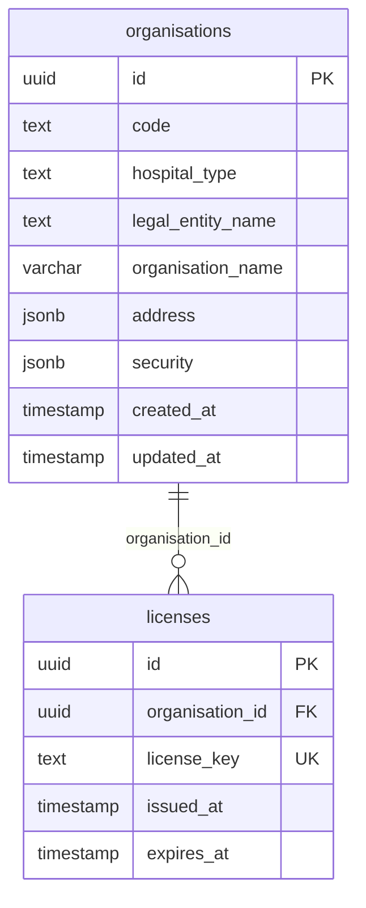

**JSONB shapes**

| Column | Fields |
|---|---|
| `organisations.address` | `country_id`, `state`, `city`, `created_at`, `created_by` |
| `organisations.security` | `enable_audit_logs`, `emergency_access` |

---

## 2. RBAC (roles, permissions, modules)

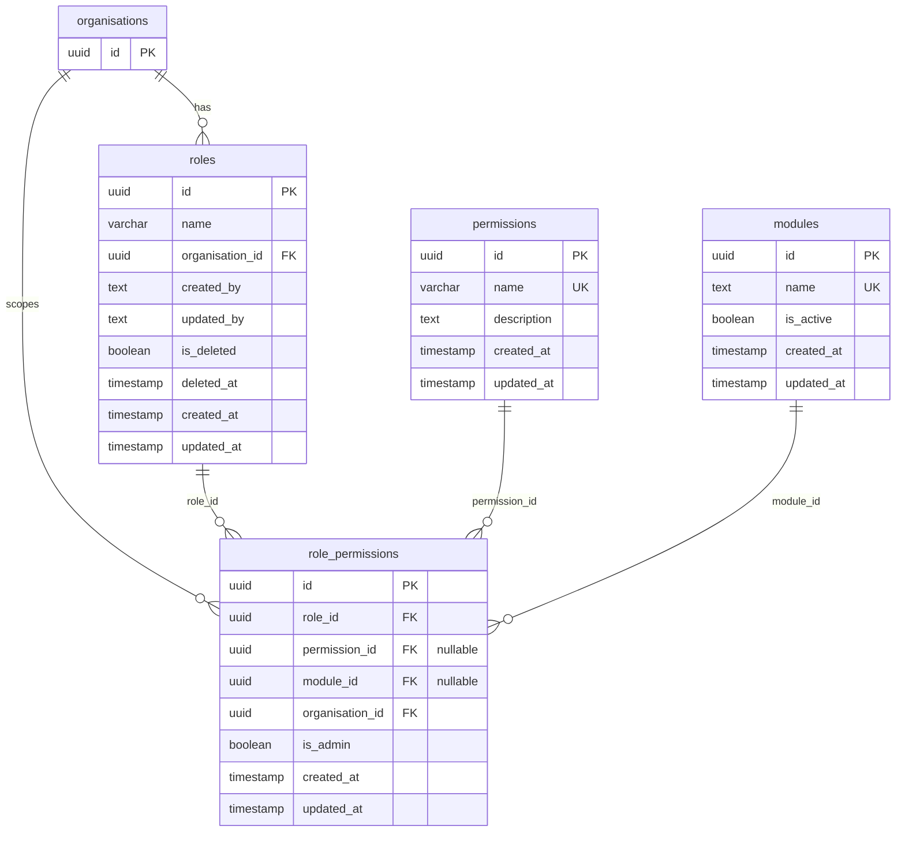

- Default role names: Super Admin, Hospital Admin, Doctor, Nurse, Receptionist, Lab Technician, Pharmacist.
- Permission names: typically `create`, `update`, `delete`, `view`.
- Admin grants may leave `permission_id` / `module_id` null (`RelaxNullableColumns`).

---

## 3. Users, departments & auth tokens

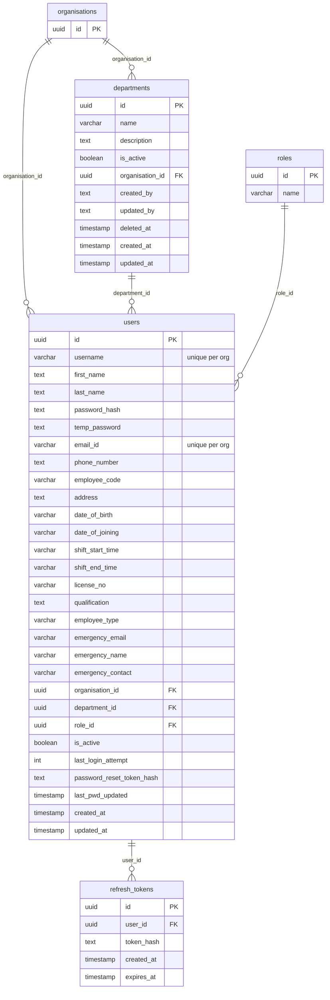

Unique indexes: `idx_org_username` (`organisation_id` + `username`), `idx_org_email` (`organisation_id` + `email_id`).

---

## 4. Patients

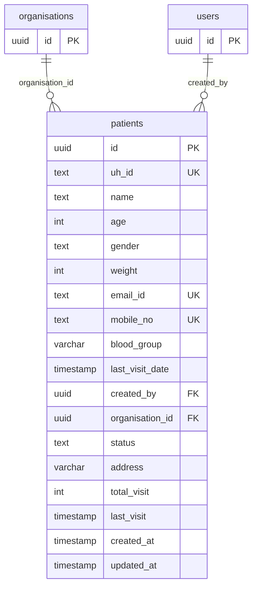

**Status values:** `pending`, `active` (DB default tag also mentions `free`).

---

## 5. Appointments & schedules

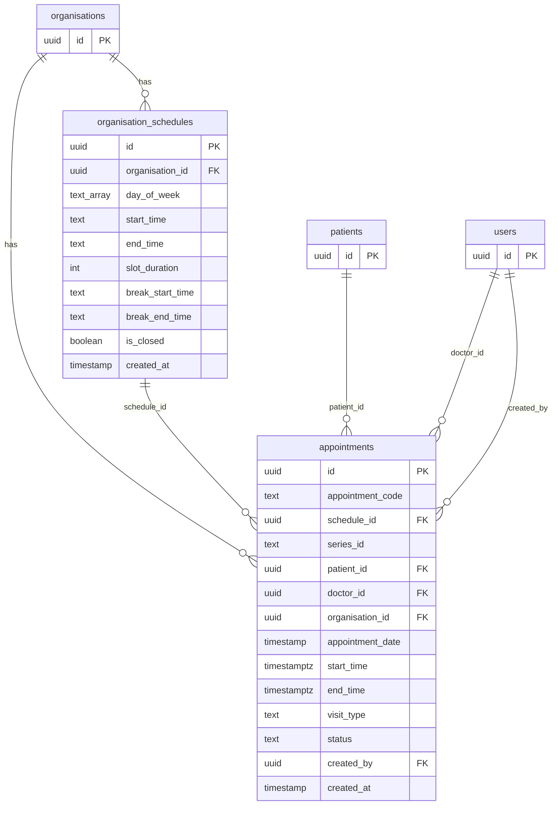

| Field | Values |
|---|---|
| `status` | `scheduled`, `completed`, `cancelled`, `ongoing`, `upcoming`, `missed`, `waiting`, `reschedule_required` |
| `visit_type` | `new_patient`, `follow_up`, `opd` |
| `day_of_week` | `MON`…`SUN` (`text[]`) |

`series_id` is a plain string — there is no appointment-series table.

---

## 6. Prescriptions

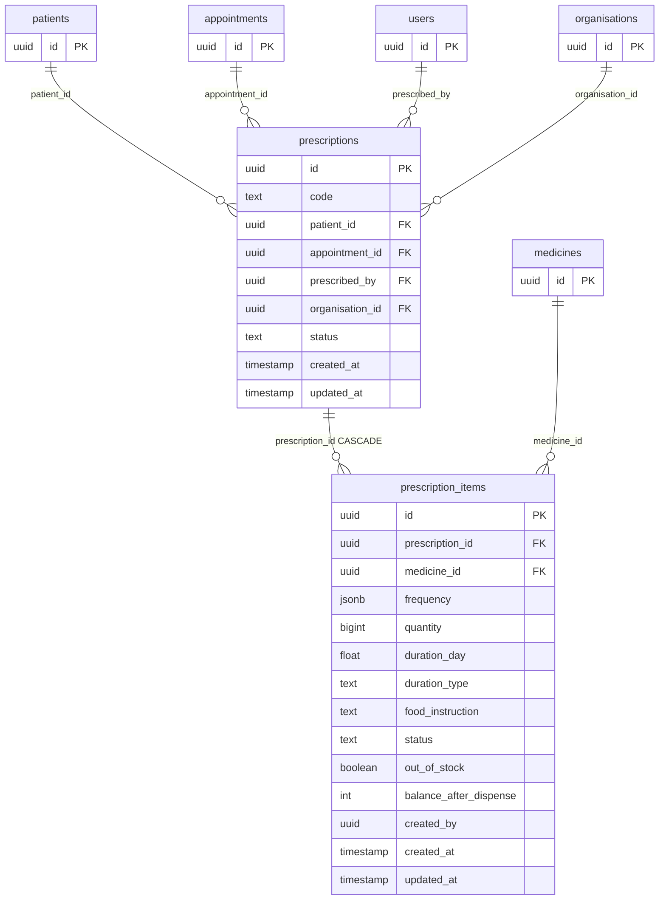

**`frequency` JSONB:** `{ morning, afternoon, night }` (floats).

**Item status examples:** `pending`, `fully_dispensed`, `partially_dispensed`.

---

## 7. Billing

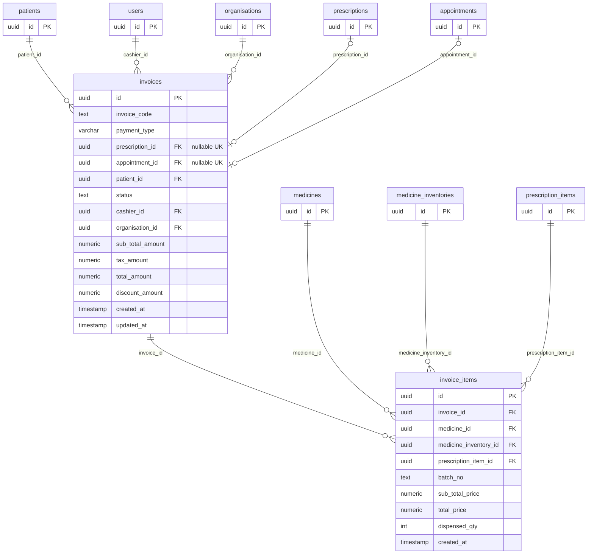

| Field | Values |
|---|---|
| `payment_type` | `consultation`, `prescription` |
| `status` | `unpaid`, `paid` |

Unique indexes on `prescription_id` and `appointment_id` guard double-billing. Consultation invoices typically have no line items.

---

## 8. Payments

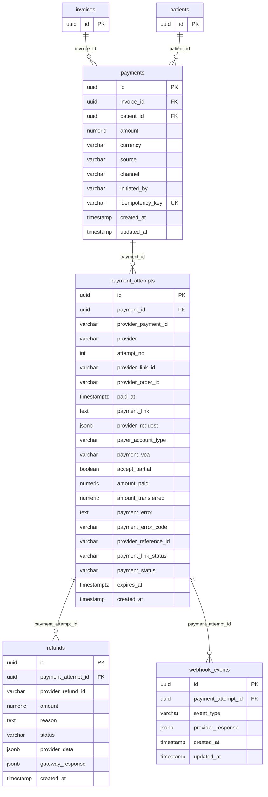

Defaults: `currency=INR`, `source=link`, `channel=upi`.

---

## 9. Medicine, inventory & suppliers

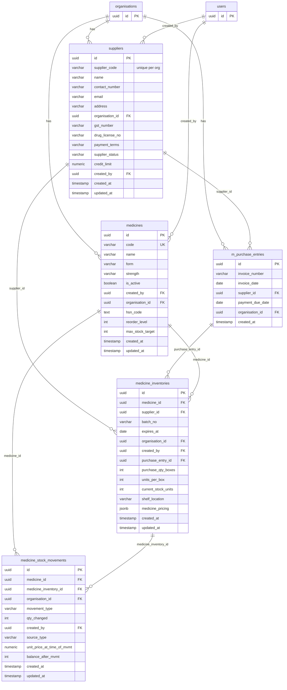

| Field | Values |
|---|---|
| `payment_terms` | Net 30, Net 15, Net 45, Advance, Cash |
| `supplier_status` | Active, Inactive |
| `movement_type` | sale, purchase, return, dispense |
| `source_type` | purchase_entry, patient_medicine_order |

**`medicine_pricing` JSONB:** `mrp`, `unit_price`, `discount`, `purchase_price`, `selling_price`.

---

## 10. Notifications

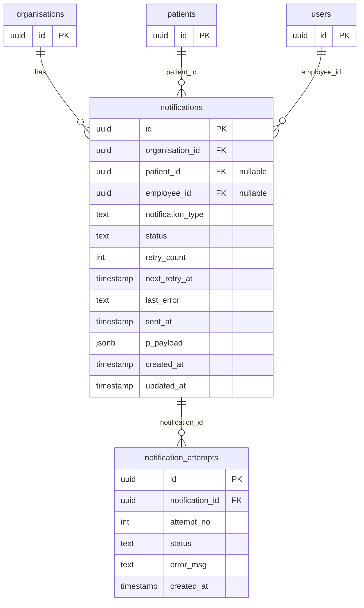

**Status flow:** `PENDING` → `PROCESSING` → `SENT` / `FAILED` / `PERMANENTLY_FAILED`.

**`p_payload` JSONB:** `content`, `channel` (e.g. EMAIL), `subject`, `recipient_email`.

---

## Entity checklist (migrated)

| # | Entity | Table (GORM default) |
|---|---|---|
| 1 | Organisation | `organisations` |
| 2 | License | `licenses` |
| 3 | User | `users` |
| 4 | RefreshToken | `refresh_tokens` |
| 5 | Patient | `patients` |
| 6 | Department | `departments` |
| 7 | Role | `roles` |
| 8 | Permission | `permissions` |
| 9 | RolePermission | `role_permissions` |
| 10 | Modules | `modules` |
| 11 | OrganisationSchedule | `organisation_schedules` |
| 12 | Appointment | `appointments` |
| 13 | Prescription | `prescriptions` |
| 14 | PrescriptionItems | `prescription_items` |
| 15 | Invoice | `invoices` |
| 16 | InvoiceItem | `invoice_items` |
| 17 | Payments | `payments` |
| 18 | PaymentAttempts | `payment_attempts` |
| 19 | Refunds | `refunds` |
| 20 | WebhookEvents | `webhook_events` |
| 21 | Supplier | `suppliers` |
| 22 | MPurchaseEntry | `m_purchase_entries` |
| 23 | Medicine | `medicines` |
| 24 | MedicineInventory | `medicine_inventories` |
| 25 | MedicineStockMovements | `medicine_stock_movements` |
| 26 | Notification | `notifications` |
| 27 | NotificationAttempts | `notification_attempts` |

**Not persisted as tables:** `dashboard` (aggregation), `authentication` (uses `users`), email/Razorpay DTO packages. Bed management (`room_types`, `rooms`, `room_summaries`, `beds`, `bed_allotments`) exists in code but is out of scope for this diagram.

---

## Core clinical flow (relationship path)

```text
Organisation
  └─ Patient
       └─ Appointment ──(doctor)──► User
            └─ Prescription ──(prescribed_by)──► User
                 ├─ PrescriptionItems ──► Medicine
                 │                         └─ MedicineInventory ──► Supplier / PurchaseEntry
                 └─ Invoice (prescription | consultation)
                      ├─ InvoiceItems ──► MedicineInventory
                      └─ Payments
                           └─ PaymentAttempts ──► Refunds / WebhookEvents
```
